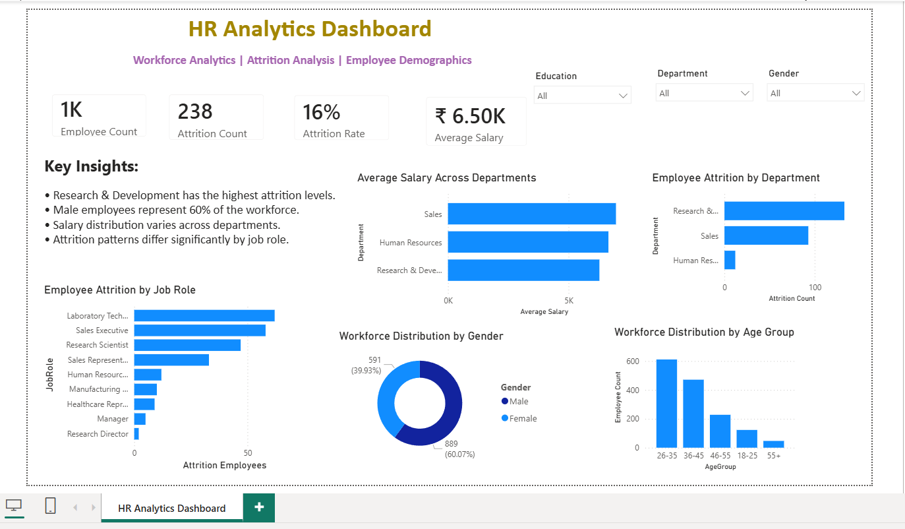
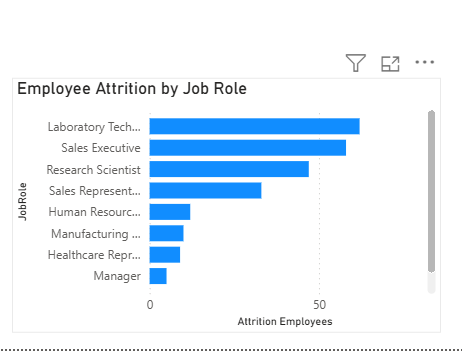

# PowerBI-HR-Analytics-Dashboard
Interactive HR Analytics Dashboard built using Power BI for workforce and attrition analysis.

# HR Analytics Dashboard

Power BI dashboard designed to analyze employee attrition, workforce demographics, salary distribution, and department performance.

## Overview

This dashboard provides insights into workforce composition, attrition trends, salary analysis, and employee demographics to support HR decision-making.

## Tools Used

- Power BI
- DAX
- Excel

## KPIs

- Employee Count
- Attrition Count
- Attrition Rate
- Average Salary

## Dashboard Features

- Attrition by Department
- Attrition by Job Role
- Employee Distribution by Gender
- Employee Distribution by Age Group
- Salary Analysis by Department
- Interactive Slicers

## Key Insights

- Research & Development has the highest attrition levels.
- Male employees represent a larger share of the workforce.
- Salary distribution varies significantly across departments.
- Attrition patterns differ by job role and department.

## Dashboard Preview

## Attrition Analysis

